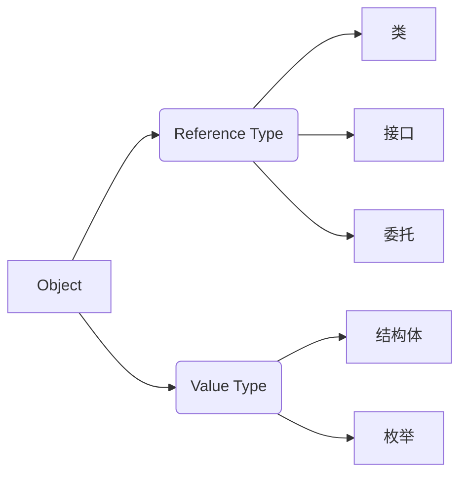

# 类型
## 什么是类型(Type)？

- 又名数据类型(Data Type)
    - A data type is a homogeneous collection of values,effectively presented,equipped with manipulate these values.
    - 是数据在内存中存储时的“型号”
    - 小内存容纳大尺寸的数据会丢失精确度、发生错误
    - 大内存容纳小尺寸的数据会导致浪费
    - 编程语言的数据类型与数学的数据类型不完全相同
  

### 补充：关于强类型语言、弱类型语言、静态语言、动态语言
[弱类型、强类型、动态类型、静态类型语言的区别是什么？-知乎](https://www.zhihu.com/question/19918532)

>- 强类型：偏向于不容忍隐式类型转换。譬如说haskell的int就不能变成double
>- 弱类型：偏向于容忍隐式类型转换。譬如说C语言的int可以变成double
>- 静态类型：编译的时候就知道每一个变量的类型，因为类型错误而不能做的事情是语法错误。
>- 动态类型：编译的时候不知道每一个变量的类型，因为类型错误而不能做的事情是运行时错误。譬如说你不能对一个数字a写a[10]当数组用。  
>作者：vczh

PS:我觉得动态语言和静态语言的分辨可以讨论讨论，但是强弱类型语言的定义太过模糊了(譬如C语言，可以看作强类型)，私以为没有必要纠结

### C#是什么样的语言？
一般来说，我们认为C#是强类型静态语言。  
但是C#有对动态类型语言的模仿，在C#新标准中，关键字dynamic可以使得变量在运行中改变自己的类型。

## 类型在C#语言中的作用
- 一个C#类型中所包含的信息有：
    - 存储此类型变量所需的内存空间大小
    - 此类型的值可表示的最大、最小值范围
    - 此类型所包含的成员(如方法、属性、事件等)
    - 此类型由何基类派生而来
    - 程序运行时，此类型的变量分配在内存的什么位置
    - 此类型所允许的操作(运算)

### 程序运行时的堆和栈
[堆和栈的区别（转过无数次的文章）-知乎](https://blog.csdn.net/hairetz/article/details/4141043)  
> 小知识:关于build和compile  
Visual Studio中编译程序的按钮名字为build而非compile，这是因为我们再一般编写程序的时候往往不仅仅需要编译当前的文件，还要把编译出的二进制代码与库函数的代码进行链接，这一过程和在一起就叫做build。

## C#语言的类型系统
- C#的五大数据类型
    - 类（Classes）：如Window，Form，Console，String
    - 结构体（Structures）：如Int32，Int64，Single，Double
    - 枚举（Enumerations）：如HorizontalAlignment，Visibility
    - 接口（Interfaces）
    - 委托（Delegates）
- C#类的派生谱系

### 和类型有关的C#关键字
  
- 关于object的一点补充  
(所有类型(包括引用类型)的基类，默认继承自该类型，下面两张截图可以证明这一点)
  
  
关于object的进一步理解[C#中的object类深入理解](https://blog.csdn.net/wnln25/article/details/6678357)

## 变量、对象和内存
- 什么是变量
    - 表面上来看(从C#代码的上下文行文来看)，变量的用途是存储数据
    - 实际上，变量表示了存储位置，并且每个变量都有一个类型，以决定什么样的值能够存入变量
    - 变量一共有七种
        - 静态变量、实例变量(成员变量、字段)、数组元素、值参数、引用参数、输出参数、局部变量
    - 变量的声明
        - 有效的修饰符组合(opt) 类型 变量名 初始化器(opt)  
- 值类型的变量
    - 以byte/sbyte/short/ushort为例
    - 值类型没有实例，所谓“实例”与变量合而为一。
- 引用类型的变量与实例
    - 引用类型变量与实例的关系：引用类型变量里存储的数据是对象的内存地址
- 局部变量是在stack上分配内存
- 变量的默认值
- 常量（值不可以改变的变量）
- 装箱与拆箱(Boxing & Unboxing)
```cs
int x;
object obj=x;//装箱
int y=(int)obj;//拆箱
```